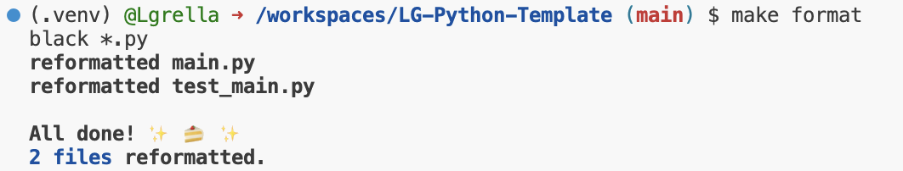
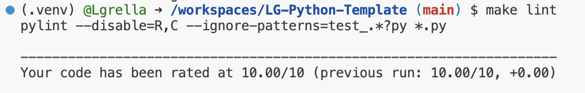
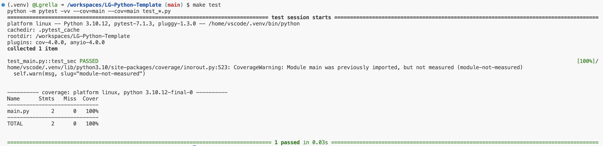

# Mini-Project 2: Pandas Descriptive Statistics
---
This repo is for the mini-project 2 for IDS 706: Data Engineering Systems

---
Using the past year of data for SPY stock, this project reads in the data as a pandas dataframe, charts the SPY daily closing price using matplotlib, and provides summary statistics.

Dataset: 

---

How to Use:

1. Open Codespaces, allow for the environmenet to be set up
2. Run the make commands: install, format, lint, test

Example Results:

`make format`:

`make lint`:

`make test`:

